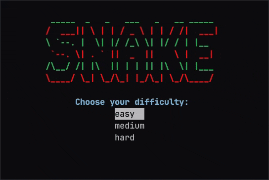

# Snake in the Terminal

<p align="center">
  
</p>

This project implements classic [Snake][1] with a simple terminal user interface
(TUI). The [ncurses][2] library and associated [menu][3] library are used to
implement the TUI.

### Usage

To build the project, you will need:

* A C++ compiler supporting C++20 features
* CMake3.13+
* ncurses dev packages

To build, navigate to the `scripts/` directory and run the build script:
```bash
./build.sh
```

After the build completes, `snake` will be installed to `snake/bin/`.

### Game Controls

You can use the arrow keys to navigate all menus and to control the snake's
movement. `ENTER` can be pressed to make a selection (e.g., when selecting the
game difficulty at the start screen).

[1]: https://en.wikipedia.org/wiki/Snake_(video_game_genre)
[2]: https://en.wikipedia.org/wiki/Ncurses
[3]: https://invisible-island.net/ncurses/man/menu.3x.html
